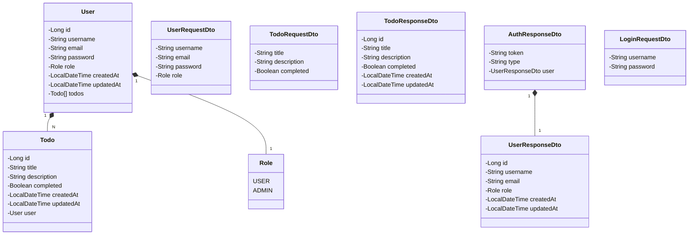

# TODO List API

RESTful API para gerenciamento de tarefas (TODO) construída com Java 21 e Spring Boot 3, implementando autenticação JWT e controle de acesso baseado em roles.

## 🚀 Demo em Produção

**API Base URL**: https://spring-boot-todo-production.up.railway.app

**Swagger UI**: [Documentação Interativa](https://spring-boot-todo-production.up.railway.app/swagger-ui/index.html)

> 💡 **Teste a API diretamente no Swagger UI em produção!**

## Principais Tecnologias

- **Java 21**: Utilizando a versão LTS mais recente para recursos modernos da linguagem
- **Spring Boot 3**: Maximizando a produtividade do desenvolvedor com auto-configuração
- **Spring Data JPA**: Simplificando o acesso a dados e integração com banco SQL
- **Spring Security**: Implementando autenticação JWT e autorização baseada em roles
- **PostgreSQL**: Banco de dados relacional robusto para produção
- **OpenAPI (Swagger)**: Criando documentação clara e abrangente da API
- **Gradle**: Sistema de build moderno com Kotlin DSL

## Diagrama de Classes (Domínio da API)



## Funcionalidades

### Autenticação e Autorização
- **JWT Authentication**: Sistema de autenticação baseado em tokens JWT
- **Role-based Access**: Controle de acesso com roles USER e ADMIN
- **User Registration**: Endpoint público para registro de novos usuários
- **Secure Login**: Autenticação segura com validação de credenciais

### Gerenciamento de Usuários (ADMIN apenas)
- **Lista de Usuários**: Visualizar todos os usuários cadastrados
- **Detalhes do Usuário**: Buscar usuário específico por ID
- **Criar Usuário**: Cadastrar novos usuários no sistema
- **Atualizar Usuário**: Modificar dados de usuários existentes
- **Remover Usuário**: Deletar usuários do sistema

### Gerenciamento de TODOs
- **TODOs por Usuário**: Cada usuário visualiza apenas suas próprias tarefas
- **CRUD Completo**: Criar, listar, atualizar e deletar tarefas
- **Status de Conclusão**: Marcar tarefas como concluídas ou pendentes
- **Isolamento de Dados**: Segurança garantindo que usuários não acessem TODOs de outros

## Arquitetura

### Estrutura do Projeto
```
src/main/java/com/example/springboottodo/
├── config/          # Configurações (Security, ModelMapper, etc.)
├── controller/      # Controladores REST (Auth, User, Todo)
├── dto/             # Data Transfer Objects (Request/Response)
├── entity/          # Entidades JPA (User, Todo, Role)
├── exception/       # Tratamento global de exceções
├── repository/      # Interfaces de repositório Spring Data
├── security/        # Componentes de segurança (JWT, Filters)
└── service/         # Lógica de negócio
```

### Padrões Implementados
- **Clean Architecture**: Separação clara entre camadas
- **Repository Pattern**: Abstração de acesso a dados
- **DTO Pattern**: Objetos específicos para transferência de dados
- **Exception Handling**: Tratamento global de erros
- **Bean Validation**: Validação de entrada usando anotações

## Documentação da API

### 🌐 Produção (Railway)
- **API Base URL**: https://spring-boot-todo-production.up.railway.app
- **Swagger UI**: https://spring-boot-todo-production.up.railway.app/swagger-ui/index.html
- **OpenAPI JSON**: https://spring-boot-todo-production.up.railway.app/v3/api-docs

### 💻 Desenvolvimento Local
- **Swagger UI**: `http://localhost:8080/swagger-ui/index.html`
- **OpenAPI JSON**: `http://localhost:8080/v3/api-docs`
- **OpenAPI YAML**: `http://localhost:8080/v3/api-docs.yaml`

### Principais Endpoints

#### Autenticação
- `POST /api/auth/login` - Realizar login
- `POST /api/auth/register` - Registrar novo usuário

#### Usuários (ADMIN apenas)
- `GET /api/users` - Listar todos os usuários
- `GET /api/users/{id}` - Buscar usuário por ID
- `POST /api/users` - Criar novo usuário
- `PUT /api/users/{id}` - Atualizar usuário
- `DELETE /api/users/{id}` - Deletar usuário

#### TODOs
- `GET /api/todos` - Listar TODOs do usuário autenticado
- `GET /api/todos/{id}` - Buscar TODO específico
- `POST /api/todos` - Criar novo TODO
- `PUT /api/todos/{id}` - Atualizar TODO
- `DELETE /api/todos/{id}` - Deletar TODO

## Como Executar

### Pré-requisitos
- Java 21 instalado
- PostgreSQL rodando (local ou Docker)
- Gradle (ou use o wrapper incluído)

### Configuração do Banco
1. Crie um banco PostgreSQL chamado `todo_db`
2. Configure as variáveis de ambiente ou edite `application.properties`:
   ```properties
   spring.datasource.url=jdbc:postgresql://localhost:5432/todo_db
   spring.datasource.username=postgres
   spring.datasource.password=postgres
   ```

### Executando a Aplicação
```bash
# Clone o repositório
git clone <repository-url>
cd spring-boot-todo

# Execute a aplicação
./gradlew bootRun

# Ou compile e execute
./gradlew build
java -jar build/libs/spring-boot-todo-0.0.1-SNAPSHOT.jar
```

### Testando a API

#### 🌐 Produção (Railway)
```bash
# Registrar um usuário
curl -X POST https://spring-boot-todo-production.up.railway.app/api/auth/register \
  -H "Content-Type: application/json" \
  -d '{
    "username": "testuser",
    "email": "test@example.com",
    "password": "password123",
    "role": "USER"
  }'

# Fazer login
curl -X POST https://spring-boot-todo-production.up.railway.app/api/auth/login \
  -H "Content-Type: application/json" \
  -d '{
    "username": "testuser",
    "password": "password123"
  }'

# Criar um TODO (usando o token recebido)
curl -X POST https://spring-boot-todo-production.up.railway.app/api/todos \
  -H "Content-Type: application/json" \
  -H "Authorization: Bearer <seu-jwt-token>" \
  -d '{
    "title": "Minha primeira tarefa",
    "description": "Descrição da tarefa",
    "completed": false
  }'
```

#### 💻 Local
```bash
# Substitua https://spring-boot-todo-production.up.railway.app por http://localhost:8080
# nos comandos acima para testar localmente
```

## Variáveis de Ambiente

| Variável | Descrição | Valor Padrão |
|----------|-----------|--------------|
| `DATABASE_URL` | URL de conexão do PostgreSQL | `jdbc:postgresql://localhost:5432/todo_db` |
| `PGUSER` | Usuário do banco de dados | `postgres` |
| `PGPASSWORD` | Senha do banco de dados | `postgres` |
| `JWT_SECRET` | Chave secreta para JWT | `mySecretKey123...` |
| `JWT_EXPIRATION` | Tempo de expiração do JWT (ms) | `86400000` (24h) |
| `PORT` | Porta da aplicação | `8080` |

## Segurança

### Autenticação JWT
- Tokens gerados com chave secreta configurável
- Expiração configurável (padrão: 24 horas)
- Refresh automático não implementado (pode ser adicionado)

### Autorização
- **Endpoints públicos**: `/api/auth/**`, `/swagger-ui/**`, `/v3/api-docs/**`
- **USER role**: Acesso aos próprios TODOs
- **ADMIN role**: Acesso total ao sistema, incluindo gestão de usuários

### Validações
- Validação de entrada usando Bean Validation
- Senhas com mínimo de 6 caracteres
- Emails com formato válido
- Usernames únicos no sistema

## Testes

```bash
# Executar todos os testes
./gradlew test

# Executar testes com relatório de cobertura
./gradlew test jacocoTestReport

# Executar testes específicos
./gradlew test --tests "AuthControllerTest"
```

## Deploy

### ✅ Railway (Em Produção)
A API já está disponível em produção no Railway:
- **URL**: https://spring-boot-todo-production.up.railway.app
- **Status**: ✅ Ativa e funcionando
- **Swagger UI**: [Acesse aqui](https://spring-boot-todo-production.up.railway.app/swagger-ui/index.html)

### 🚀 Deploy seu próprio
1. Fork este repositório
2. Conecte sua conta Railway ao GitHub
3. Crie um novo projeto no Railway
4. Configure as variáveis de ambiente necessárias
5. Deploy automático será executado

### Docker
```dockerfile
FROM openjdk:21-jdk-slim
COPY build/libs/spring-boot-todo-0.0.1-SNAPSHOT.jar app.jar
EXPOSE 8080
ENTRYPOINT ["java", "-jar", "/app.jar"]
```

## Contribuindo

1. Fork o projeto
2. Crie uma branch para sua feature (`git checkout -b feature/AmazingFeature`)
3. Commit suas mudanças (`git commit -m 'Add some AmazingFeature'`)
4. Push para a branch (`git push origin feature/AmazingFeature`)
5. Abra um Pull Request

### Padrões de Contribuição
- Siga as convenções de código Java
- Adicione testes para novas funcionalidades
- Atualize a documentação quando necessário
- Use commits semânticos quando possível

## Licença

Este projeto está licenciado sob a [MIT License](LICENSE).

## Contato

Se você tiver dúvidas ou sugestões, sinta-se à vontade para abrir uma issue ou entrar em contato:

- **Email**: support@todoapi.com
- **GitHub Issues**: [Link para issues](../../issues)

---

⭐ **Desenvolvido com Spring Boot 3 e Java 21**